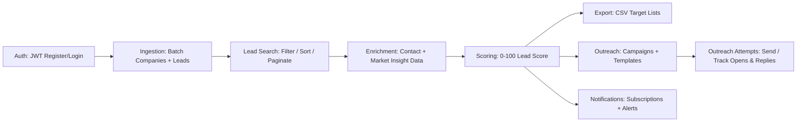

# StartDown — AI-Assisted B2B Market Intelligence & Lead Generation Platform

A backend MVP for turning raw company data into **prioritized, enriched leads** — built around the core problem every sales/growth team faces: too much raw company data, not enough signal on who's actually worth reaching out to.

## The problem this solves

B2B teams don't struggle to *find* companies — they struggle to know which ones are worth their time, what to say to them, and how to track whether outreach is working. StartDown models that entire workflow as a backend service: ingest → enrich → score → export → outreach → notify, with each stage as an independently testable API surface rather than a single monolithic script.

## Core Flow

| Stage | What it does |
|---|---|
| **Auth** | [JWT](https://jwt.io/introduction)-based register/login, bearer token auth on all endpoints |
| **Ingestion** | Batch-load companies and leads from JSON payloads |
| **Lead Search** | Filter/sort/paginate by score, industry, location, funding, enrichment status |
| **Enrichment** | Generate/mock missing contact and company/market insight data |
| **Scoring** | Rule-based 0–100 lead score from industry, location, funding, and data completeness (plus an advanced scoring service in code) |
| **Export** | Download filtered leads as CSV, with optional enrichment fields |
| **Outreach** | Create campaigns/templates, send single or bulk outreach, track opens/replies |
| **Notifications** | Subscribe to lead/company/new-lead events, with delivery logged |

## Why it's built this way

- **Rule-based scoring over black-box ML** — a transparent, tunable scoring model ([industry fit](https://en.wikipedia.org/wiki/Lead_scoring), location, funding stage, data completeness) so sales teams can see *why* a lead is ranked the way it is, not just trust a number.
- **Enrichment as a separate stage from ingestion** — raw lead data is rarely complete; treating enrichment as its own pipeline step means partial data doesn't block the rest of the flow.
- **Outreach and notifications decoupled from scoring** — campaigns and alerts consume lead data rather than owning it, so the scoring logic can evolve independently of how leads get acted on.
- **SQLite for dev, Postgres for prod** — same [SQLAlchemy](https://www.sqlalchemy.org/) models, swappable backend via config, no code changes to move from local dev to a production database.

## Data Model

| Entity | Purpose |
|---|---|
| `User` | Auth identity, owns campaigns and subscriptions |
| `Company` | Core company record |
| `Lead` | Individual lead tied to a company, carries score + enrichment status |
| `LeadEnrichment` | Enriched contact/company/market fields for a lead |
| `NotificationSubscription` / `NotificationLog` | Alert rules and delivery history |
| `OutreachCampaign` / `OutreachAttempt` | Campaign definitions and per-send tracking (opens, replies) |

## Tech Stack

